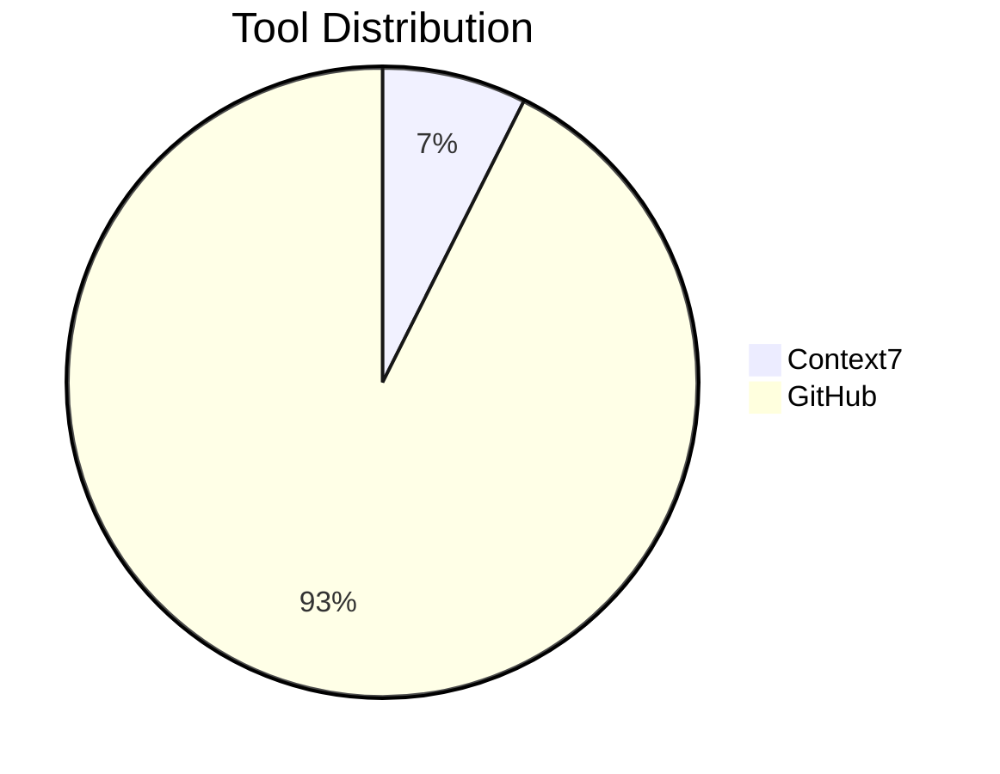

# MCP Tool Registry

## Purpose
Documentation for available MCP tools and their integration patterns

## Current Tool Inventory


## Tool Registry Table
| Task Category | MCP Server | Tools | Usage Pattern |
|---------------|------------|-------|---------------|
| Documentation | Context7 | `resolve-library-id`, `get-library-docs` | Auto-trigger when unknown libraries detected |
| Code Management | GitHub | `create_issue`, `get_file_contents` | Manual invocation with user approval |
| Code Review | GitHub | `create_pull_request`, `add_pull_request_review_comment` | Post-implementation workflow |

## Usage Guidelines
1. **Discovery Phase**  
   Always check registry before implementing new features  
   
2. **Execution Rules**  
   - Requires user approval for write operations  
   - Auto-approved for read-only queries  

## Example Patterns
```markdown
### Feature Implementation Workflow
1. `create_issue` - Track feature work
2. `get-library-docs` - Research required APIs
3. `create_pull_request` - Submit changes
```

## Version History
- v0.1 (2024-06-18): Initial registry with core tools
